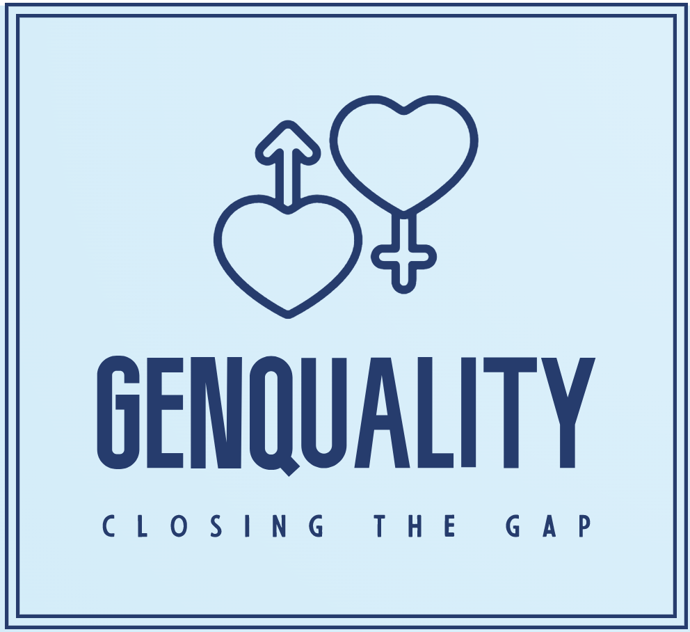
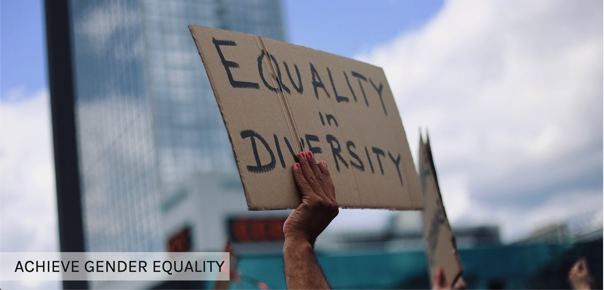
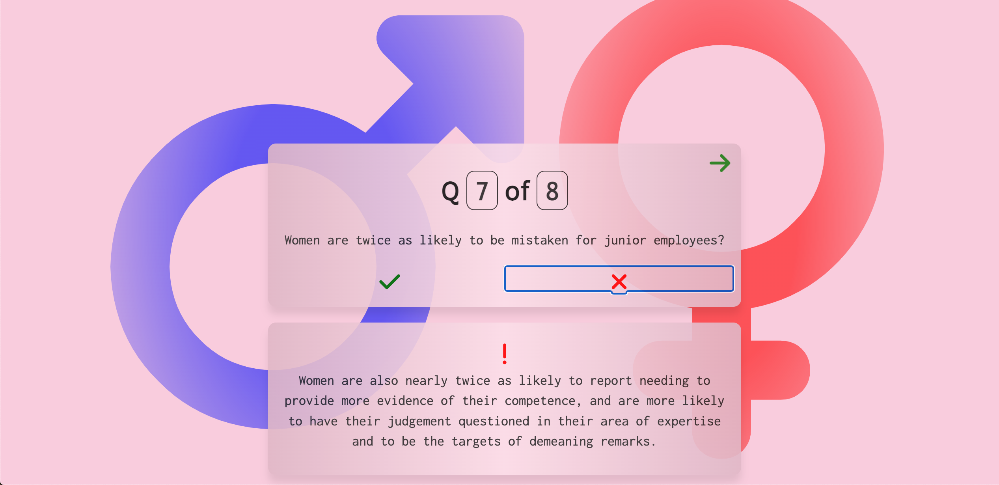
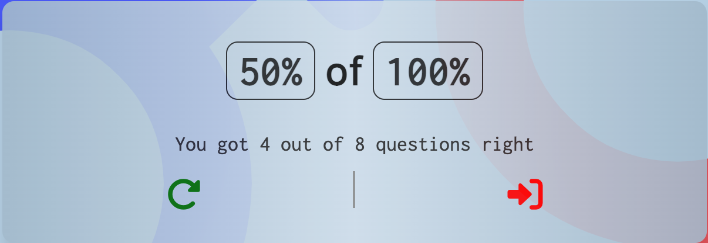
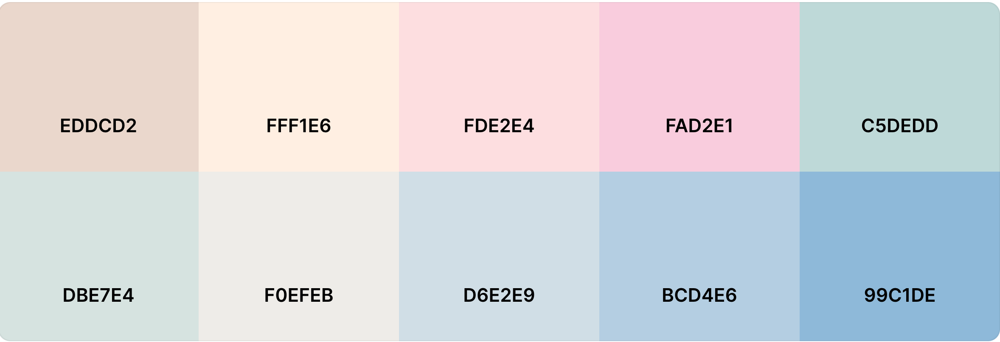

- [Site Overview](#site-overview)
  - [Goal](#goal)
  - [Technologies used](#technologies-used)
- [UX](#ux)
  - [Target Audience](#target-audience)
  - [User Stories](#user-stories)
- [Features](#features)
  - [Existing Features](#existing-features)
  - [Future Features](#future-features)
- [Design](#design)
  - [Wireframes](#wireframes)
  - [Typography](#typography)
  - [Images](#images)
  - [Colour Scheme](#colour-scheme)
- [Testing](#testing)
- [The Team](#the-team)
- [Credits](#credits)
    - [Github cards](#github-cards)
    - [Images](#images-1)
    - [Version Control](#version-control)

# Site Overview
Genquality is a website built as a project for September's Hackathon with Code Institute, Deloitte and Trust in Soda. The theme given was 'Closing the gender gap' and so we decided a good way to tackle this issue was with an educational and enlightening quiz, along with some resources and information on how the user can make a difference.

## Goal
The goal of our website is to see how aware the user really is about the gender gap. Some users might be shocked by some of the facts and statistics, while others may not. For those with less knowledge about the topic, we want to provide resources where they can learn more and also how they can help close the gap in their workplace and their life. The overall aim of this project is to bring awareness to the inequality in workplaces, each gender being affected in different ways.

## Technologies used

- [HTML5](https://en.wikipedia.org/wiki/HTML5) for the contents and structure of the website.
- [CSS3](https://en.wikipedia.org/wiki/CSS) for the styling and animations.
- [Balsamiq](https://balsamiq.com/) for wireframing.
- [GitPod](https://gitpod.io/) as a local IDE & repository.
- [GitHub](https://github.com/) as a remote repository.
- [GitHub Pages](https://pages.github.com/) to deploy the website.
- [Chrome](https://www.google.com/intl/en_ie/chrome/),  [Firefox](https://www.mozilla.org/en-US/firefox/new/),
[Brave Browser](https://brave.com/),
[Edge](https://www.microsoft.com/en-us/edge) and [Opera](https://www.opera.com/) for browser testing the responsiveness.
- [Chrome Developer Tools](https://developer.chrome.com/docs/devtools/) for testing screen sizes and using [Lighthouse](https://developers.google.com/web/tools/lighthouse).
- [Remove Image Background](https://www.remove.bg/) to remove background from logo.
- [Wave Chrome extension](https://wave.webaim.org/) to check web accessibility.
- [Pesticide Chrome extension](https://chrome.google.com/webstore/detail/pesticide-for-chrome-with/neonnmencpneifkhlmhmfhfiklgjmloi) during development.
- [Am I Responsive](http://ami.responsivedesign.is/) for testing and to make responsive image.

# UX
## Target Audience
* Employees
* Employers
* Activists
* Those who want to make a difference

## User Stories
* As a first time visitor to the website, I want to know what it's about as soon as I land on the home page.
* As a user, I want to be able to navigate the website easily and always know what page I'm on.
* As a user I want to be able to have quick access to a fun quiz from both the landing page and a dedicated area in the nav bar.
* As a user, I want to find out more information relating to the topic with ease.
* As a user, I want to find out who created the website and why it was made.
# Features

## Existing Features
* __Hero image__
  - User story: *As a first time visitor to the website, I want to know what it's about as soon as I land on the home page.*
  - We chose a hero image that we felt conveys the topic of the website immediately and catches attention.
  - Over the hero image, we have some text reiterating the point of the website.
  

* __Navigation Bar__
  - User story: *As a user, I want to be able to navigate the website easily and always know what page I'm on.*
  - Our nav bar includes the website title, logo and links to all main aspects of the website.
  - Whichever page the user is currently on is highlighted in the nav bar.

* __Quiz Button__
  - User story: *As a user I want to be able to have quick access to a fun quiz from both the landing page and a dedicated area in the nav bar.*
  - We included a button that redirects the user straight to the quiz page from the landing page. 
  - This means the user can go straight from reading about the topic to the quiz.

* __Landing Page Information & Graphic__
  - User story: *As a first time visitor to the website, I want to know what it's about as soon as I land on the home page.*
  - Also included on the landing page is a colourful graphic to portray the topic.
  - Beside it we also have included a small paragraph of text stating some information about the topic, so that the user has a brief idea what the website entails.

* __Quiz__
  - Our quiz that was built using JavaScript gives a series of 8 questions. 
  - Should the user answer correctly, the quiz moves onto the next question.
  - If the user answers incorrectly, the quiz gives an explanation as to why they are wrong.

  - At the end of the quiz, it displays the user's results and the option to restart or exit.
  - The exit button brings the user straight to the resources page so that they can learn more about the topic and perhaps improve their score in the future.

## Future Features

# Design
We went into this project with the aim of being unbiased to any gender, and also making the information as clear and concise as possible. 

## Wireframes

[Wireframe](project_files/wireframes/wireframe.png)

## Typography

For our fonts, we decided to use 'Karla', a sans serif font, and 'Inconsolata'. We felt these two fonts complimented each other well; the simplicity of 'Inconsolata' helping us portray our information as factual and official.

## Images

Images that were used varied from stock images of co-workers, to protest signs and cartoon illustrations. We wanted to show all the different sides to this topic and we feel the images we've chosen show this.

## Colour Scheme

For our colour scheme, we used coolors.co to generate a palette that we felt was neutral enough not to bias any particular gender, and was also light enough that text and other images would contrast well with the colours. 

# Testing

# The Team

* https://github.com/petrugio
* https://github.com/Raivis80
* https://github.com/lukaszkukla
* https://github.com/Tiyko
* https://github.com/gracemcken

# Credits

### Github cards
Github cards were generated using [GitHub Dev Widget](https://github-devprofile-card.netlify.app/generate).

### Images
* Some images were taken from [pexels.com](pexels.com).
* [This image](assets/images/gender-equality.jpg) by <a href="https://www.freepik.com/free-vector/gender-equality-concept_8944679.htm#query=gender%20equality&position=13&from_view=keyword">Freepik</a>
* [This image](assets/images/equal.jpeg) by <a href="https://www.freepik.com/free-vector/gender-equality-concept-with-man-woman_8786149.htm#query=gender%20equality&position=17&from_view=keyword">Freepik</a>
* [This image](assets/images/equality2.jpeg) by <a href="https://www.freepik.com/free-vector/gender-equality-illustration-style_8918398.htm#query=gender%20equality&position=4&from_view=keyword">Freepik</a>

### Version Control
*   Git was used as the version control software. Commands such as git add ., git status, git commit and git push were used to add, save, stage and push the code to the GitHub repository where the source code is stored.

* [GitKraken](https://www.gitkraken.com/) was also used for git version control when working locally from my PC.